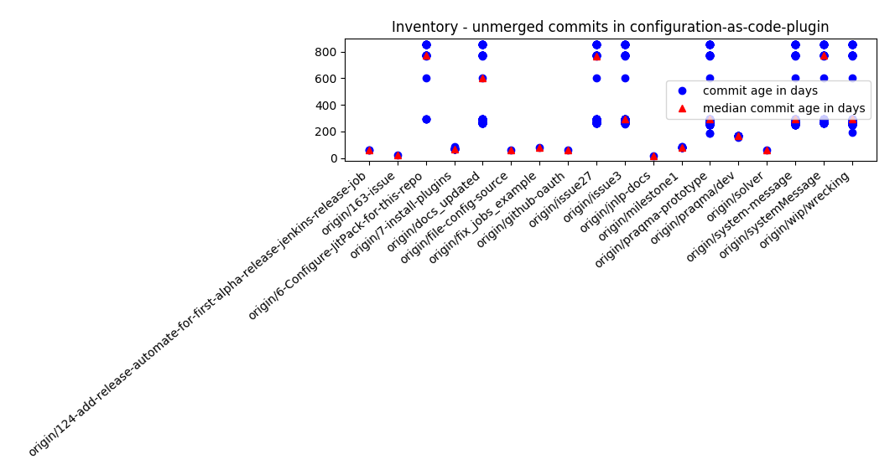
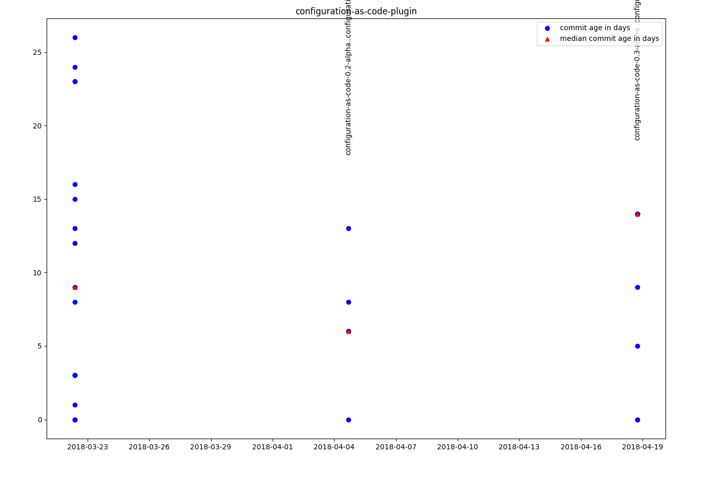

# Git Metrics

This project helps analyse a git repo that has beforehand been cloned to a local directory.

There are two types of data we currently support gathering of and plotting, Open branches and Release lead time.

## Open branches

Open branches gathers information about the age of all commits in a branch that are not yet merged into the master branch. This can help visualize how much value is not yet integrated into the project, or the potential merge cost of all code that is not yet shared between developers.

## Release Lead Time

Release lead time is at best a estimate and can be tricky if not impossible to get from your repository, git metrics tries its best.

Using tags that looks like release tags, you can help it with a "fn match" pattern. It tries to bin commits into a release that was, most likely, the first release including that change.

This data can be plotted and show things like how old the oldest change was for each release.

## Installation

**Requirement:** Python 3

To install dependencies:
	`pip install -r requirements.txt`

for more help run:
	`python git_metrics.py --help`

### Python 2 systems

Those OS with Python 2 as default, e.g. Ubuntu 17/16, you need to use pip and python explicitly if you didn't change the default:

Call the script with:

	python3 git_metrics.py --help

Install pip3 if not already installed and configure dependencies with pip3, e.g. Ubuntu 16/17:

	sudo apt-get install python3-pip
	pip3 install -r requirements.txt

On Ubuntu you might also miss the `python3-tk` package if doing plots

	sudo apt install python3-tk

## Usage

Call script with

	python3 git_metrics.py --help

which will show basic usage information like:

	Calculate age of commits in open remote branches

	Usage:
	    git_metrics.py open-branches [--master-branch=<branch>] <path_to_git_repo>
	    git_metrics.py open-branches [--master-branch=<branch>] --plot <path_to_git_repo>
	    git_metrics.py release-lead-time [--tag-pattern=<fn_match>] [--earliest-date=<timestamp>] <path_to_git_repo>
	    git_metrics.py release-lead-time --plot [--tag-pattern=<fn_match>] <path_to_git_repo>
	    git_metrics.py plot --open-branches <csv_file>
	    git_metrics.py plot --release-lead-time <csv_file>
	    git_metrics.py batch --open-branches <path_to_git_repos>...
	    git_metrics.py batch --release-lead-time [--earliest-date=<timestamp>] <path_to_git_repos>...
	    git_metrics.py (-h | --help)

	    Options:
	        --master-branch=<branch>    example: origin/gh-pages

* **`--plot`** parameter will open a GnuPlot plot, and will not will not save your data.
* To _save data_ use without plot and pipe to file for csv format: `git_metrics.py release-lead-time <path_to_git-repo> > my-csv-file.csv`
* Use plot command to plot existing csv files, e.g. `git_metrics.py plot --release-lead-time my-csv-file.csv`
* `batch` (undocumented)
